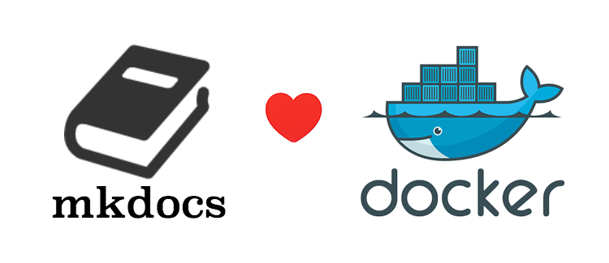

# Mkdocs Server



## Introduction

Mkdocs-server helps to run mkdocs without install python or anything.

## Usage

Clone the mkdocs project in `/home/myname/mydocs` or anywhere, then run this command.

```
docker run -d -p 8000:8000 -v /home/myname/mydocs:/mkdocs tobegit3hub/mkdocs-server
```
