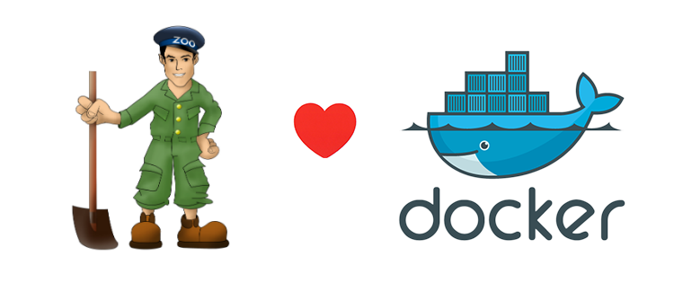

# standalone-zookeeper



## Introduction

It's super easy to launch standalone ZooKeeper with one command.

This [container](https://registry.hub.docker.com/u/tobegit3hub/standalone-zookeeper/) is based on Ubuntu 14.10, Oracle Java 7 and latest ZooKeeper(3.6.0-SNAPSHOT).

## Usage

Run `docker run -d --net=host tobegit3hub/standalone-zookeeper`.

```
➜  docker run -d --net=host tobegit3hub/standalone-zookeeper
72d2c3289c120412da35832a0dd615e25bfae3f9084b69dbac30ac426daf2b82
➜  echo "ruok" |nc 127.0.0.1 2181
imok#
```

## Reference

If you want to learn ZooKeeper shell, it would be better to use [zookeeper-shell](https://github.com/tobegit3hub/zookeeper-shell).